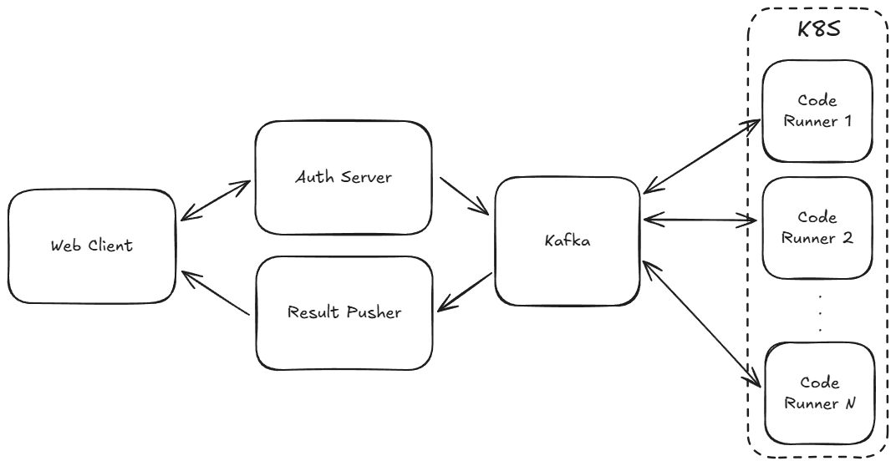

# Simple Code Runner

## Purpose

The goal is to become a better developer through the experience of designing, implementing, and deploying a scalable and extensible system!

To focus more on design and deployment, I have chosen a relatively simple business logic for this project.

## Overview

The Service that provides a web-based platform where users can submit code for execution. It includes:

- user authentication
- language-specific code runners
- queue-based job distribution system

### Check out the details at [docs](/docs/)
